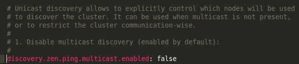

Cloudify Integration Tests
==========================

## Goal

This project aims to emulate a Cloudify Manager environment.
By doing that we can test a full cloudify pipeline in an isolated environment, without using mocks (almost...).

# Setup

In this tutorial we will be installing a few Linux packages.
However, in order to make this tutorial as agnostic as possible to different linux distributions,
we will not be using Linux package managers, but rather compressed all-in-one distributions.
This also has the benefit of not adding and manipulating system wide configuration files.
Its best to create a dedicated directory for all of these packages, we will be using `~/dev/tools`
Also, make sure you activate the virtualenv dedicated for cloudify prior to running any install commands.

## Step 1: Install RabbitMQ Server

RabbitMQ is a Message broker written in Erlang. It servers as the message broker for our remote task execution engine (celery),
So, we need to [install Erlang](https://www.erlang-solutions.com/downloads/download-erlang-otp) first.

Now we can install rabbit: <br>

```bash
~/dev/tools$ curl -L -O https://www.rabbitmq.com/releases/rabbitmq-server/v3.4.2/rabbitmq-server-generic-unix-3.4.2.tar.gz
~/dev/tools$ tar -xvf rabbitmq-server-generic-unix-3.4.2.tar.gz
```

Add the `~/dev/tools/rabbitmq_server-3.4.2/sbin` directory to your path. Verify this by starting a new shell and running: <br>

```bash
~/dev/tools$ which rabbitmq-server
```

## Step 2: Install Elasticsearch

Elasticsearch is our storage data store, we use it to store:

- Events
- Logs
- Static/Runtime blueprints data.

```bash
~/dev/tools$ curl -L -O https://download.elasticsearch.org/elasticsearch/elasticsearch/elasticsearch-1.4.2.tar.gz
tar -xvf elasticsearch-1.4.2.tar.gz
```

Add the `~/dev/tools/elasticsearch-1.4.2/bin` directory to your path. Verify this by starting a new shell and running: <br>

```bash
~/dev/tools$ which elasticsearch
```

By default, Elasticsearch is started with multicast enabled,
this can cause some strange behaviour when other instances of elasticsearch are running on the same network.
We want to disable this. To do so you need to uncomment the `discovery.zen.ping.multicast.enabled: false` in the `~/dev/tools/elasticsearch-1.4.2/config/elasticsearch.yml`



## Step 3: Installing Riemann

Riemann is a policy and event processing engine. We use to create monitoring policies.

```bash
~/dev/tools$ wget http://aphyr.com/riemann/riemann-0.2.6.tar.bz2
~/dev/tools$ tar xvfj riemann-0.2.6.tar.bz2
```

Add the `~/dev/tools/riemann-0.2.6/bin` directory to your path. Verify this by starting a new shell and running: <br>

```bash
~/dev/tools$ which riemann
```

## Step 4: Installing riemann controller

The riemann controller is a cloudify plugin to configure riemann for our usage.
cd into the directory containing this file and run:

```bash
pip install -e ../plugins/riemann-controller
```

## Step 5: Installing Workflows

The *workflows* project contains cloudify system workflows, i.e, workflows that we use for managerial configuration.
Specifically, it contains workflows that create/delete deployments.
cd into the directory containing this file and run:

```bash
pip install -e ../workflows
```

## Step 6: Installing REST service

The *rest-service* project is the REST gateway all clients connect to.
We will be running it as part of the tests, so we need install its dependencies.
cd into the directory containing this file and run:

```bash
pip install -r ../rest-service/dev-requirements.txt -e ../rest-service
```

## Installing tests framework

These tests fork celery processes, we want these processes to have access to code written in the project (utility methods and such),
that's why we need to install it as well.
cd into the directory containing this file and run:

```bash
pip install -r dev-requirements.txt -e .
```

# Step 7: Verify installation.

Lets verify everything works by running a test. cd into the directory containing this file and run:

```bash
nosetests -s workflow_tests/test_workflow.py:BasicWorkflowsTest.test_execute_operation
```

# Usage